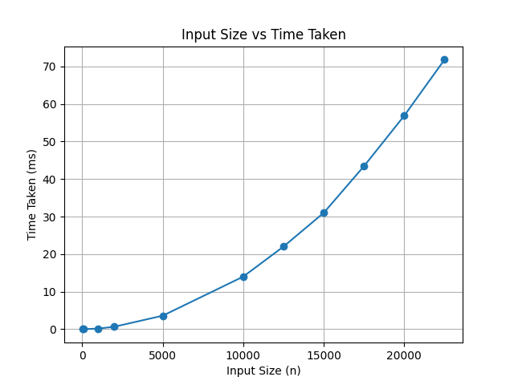
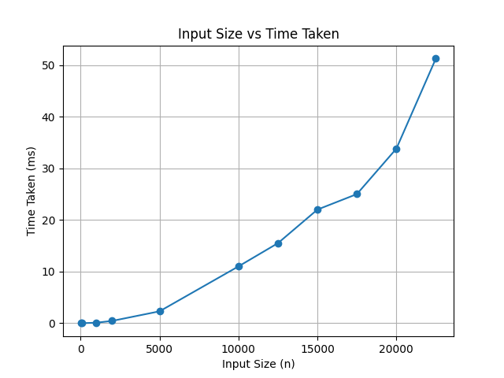
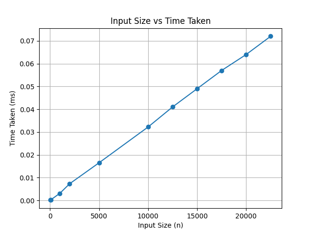

# Algorithms

## Practical-1: Power of a Number

### **Aim**
To implement and compare two methods to calculate the value of a number raised to the power **n** using recursion.

### **Theory**
The optimized recursive method calculates the result by dividing the exponent into halves, which reduces the number of recursive calls.

The simple recursive method calculates the result by multiplying the base repeatedly until the exponent becomes zero.

**Time Complexity**
- Optimized recursive method: **O(log n)**
- Simple recursive method: **O(n)**

**Space Complexity**
- Optimized recursive method: **O(log n)**
- Simple recursive method: **O(n)**

### **What the Code Does**
This program calculates the power of a number using two different recursive approaches.

The **powerRec(x, n)** method uses a divide and conquer approach.  
If the exponent is zero, it returns **1**.  
If the exponent is negative, it converts it into a positive exponent.

The method recursively computes **x^(n/2)** and stores it in a variable.  
If the exponent is even, it multiplies the half result with itself.  
If the exponent is odd, it multiplies the result with **x** once more.

This approach is efficient and works well for large values of **n**.

The **powerRec2(x, n)** method is a simple recursive approach.  
It multiplies **x** with the result of the function called with **n − 1**.  
This process continues until the exponent becomes zero.

This method is easier to understand but slower for large values of **n**.

### **Conclusion**
Both methods correctly calculate the power of a number.  
The optimized recursive method is more efficient due to fewer recursive calls.

## Practical-2: Tower of Hanoi

### **Aim**
To implement the Tower of Hanoi problem using recursion and display the sequence of moves required to transfer all disks from the source rod to the destination rod.

### **Theory**
The Tower of Hanoi is a problem where a given number of disks are moved from one rod to another using an auxiliary rod, following specific rules.

Only one disk can be moved at a time.  
A larger disk cannot be placed on top of a smaller disk.  
All disks must be moved from the source rod to the destination rod.

The problem is solved recursively by breaking it down into smaller subproblems.

**Time Complexity**
- The algorithm makes \(2^n - 1\) moves.
- Time complexity is **O(2^n)**.

**Space Complexity**
- Recursive calls use stack space up to depth **n**.
- Space complexity is **O(n)**.

### **What the Code Does**
This program takes the number of disks as input from the user and prints the steps required to solve the Tower of Hanoi problem.

The **TOH(n, src, dest, ex)** method works recursively:
- If the number of disks is less than or equal to zero, the function returns.
- If there is only one disk, it is moved directly from the source rod to the destination rod.
- For more than one disk, the method first moves **n−1** disks from the source rod to the extra rod.
- Then it moves the largest disk from the source rod to the destination rod.
- Finally, it moves the **n−1** disks from the extra rod to the destination rod.

The **main** method reads the number of disks from the user and initiates the recursive process by calling the TOH function.

### **Conclusion**
The program successfully demonstrates the use of recursion to solve the Tower of Hanoi problem.  
It clearly shows how a complex problem can be broken down into simpler recursive steps.

## Practical-3: Permutations of a String

### **Aim**
To generate and print all possible permutations of a given string using recursion.

### **Theory**
A permutation is a different arrangement of the characters of a string.  
This problem is best solved using recursion along with backtracking.

The idea is to fix one character at a time and then generate permutations for the remaining characters.  
After each recursive call, backtracking is used to restore the original order of characters so that other permutations can be formed.

**Time Complexity**
- A string of length n has n! permutations.
- Time complexity is **O(n!)**.

**Space Complexity**
- The maximum depth of the recursive call stack is **n**.
- Space complexity is **O(n)** (excluding the space used to print output).

### **What the Code Does**
This program prints all permutations of a given character array.

The **perm(char[] str, int i)** function works recursively.  
When the index **i** becomes equal to the length of the array, the current arrangement of characters is printed as one permutation.

If the index is less than the length of the array, the function runs a loop from **i** to the end of the array.  
During each iteration, the characters at positions **i** and **j** are swapped.  
The function then calls itself for the next index to generate further permutations.

After the recursive call, the characters are swapped back to their original positions.  
This step is important because it allows the function to explore all possible arrangements.

The **swapChar** function simply swaps two characters in the array.  
The **main** method defines the string and starts the permutation process.

### **Conclusion**
The program correctly generates all possible permutations of a string.  
It clearly shows how recursion and backtracking are used together to solve this problem.

## Practical-4: Velocity Reduction Using Recursion

### **Aim**
To calculate the number of steps required for a given velocity to reduce below a certain limit using recursion.

### **Theory**
This program uses recursion to repeatedly reduce the value of velocity until it becomes less than 1.  
In each step, the velocity is decreased by a fixed percentage of its current value.

A counter is used to keep track of how many recursive calls (steps) are required to reach the stopping condition.

**Time Complexity**
- The function keeps reducing the velocity until it becomes less than 1.
- Time complexity is **O(k)**, where *k* is the number of reductions needed.

**Space Complexity**
- Recursive calls use stack space equal to the number of steps.
- Space complexity is **O(k)**.

### **What the Code Does**
This program calculates how many times a velocity value needs to be reduced before it becomes less than 1.

The **tips(double v, int t)** function works recursively.  
If the velocity **v** is greater than or equal to 1, the counter **t** is increased by 1.  
The velocity is then reduced by **42.5%** of its current value.  
The function calls itself with the updated velocity and counter.

When the velocity becomes less than 1, the function stops and returns the total count.

The **main** method starts the process with an initial velocity of **40** and prints the number of steps required.

### **Conclusion**
The program successfully shows how recursion can be used to repeatedly reduce a value until a condition is met.  
It also demonstrates the use of a counter to track the number of recursive steps.

## Practical-5: Horner’s Rule Using Recursion

### **Aim**
To represent a polynomial expression using Horner’s Rule with the help of recursion.

### **Theory**
Horner’s Rule is an efficient way to write and evaluate a polynomial by reducing the number of multiplications.  
Instead of writing the polynomial in expanded form, it is rewritten in a nested form.

Recursion is used here to build the polynomial expression step by step from the coefficient array.

**Time Complexity**
- Each coefficient is processed once.
- Time complexity is **O(n)**, where *n* is the number of coefficients.

**Space Complexity**
- Recursive calls use stack space up to the number of coefficients.
- Space complexity is **O(n)**.

### **What the Code Does**
This program generates a polynomial expression using Horner’s Rule.

The **HR(int i, int[] arr)** function works recursively.  
If the index **i** reaches the last element of the array, the function returns that coefficient as a string.

If the index is not the last one, the function returns the current coefficient followed by a nested expression using **x**, and then calls itself for the next index.  
This creates a polynomial expression in Horner’s form.

The **main** method defines an array of coefficients and starts the recursive process from index 0.  
The final polynomial expression is then printed.

### **Conclusion**
The program successfully demonstrates how Horner’s Rule can be represented using recursion.

## Practical-6: Finding Duplicate in a Consecutive Array

### **Aim**
To find the duplicate element in an array of consecutive numbers using a simple comparison-based approach.

### **Theory**
In an array of consecutive numbers, each element is expected to match its index value.  
If any element does not match its index, it indicates the presence of a duplicate.

This program checks each element against its index to detect the duplicate value.

**Time Complexity**
- The array is traversed once.
- Time complexity is **O(n)**.

**Space Complexity**
- No extra data structures are used.
- Space complexity is **O(1)**.

### **What the Code Does**
This program finds a duplicate number in an array containing consecutive values.

The **findDup(int[] nums)** function loops through the array.  
For each index, it compares the value stored at that position with the index itself using the XOR operator.

If the value does not match the index, the function immediately returns that value as the duplicate.  
If no mismatch is found, the function returns **-1**.

The **main** method defines an example array with one duplicate element, calls the function, and prints the duplicate number.

### **Conclusion**
The program correctly identifies the duplicate element in a consecutive array.  
It demonstrates how a simple linear scan can be used to efficiently detect errors in ordered data.

## Practical-7: Selection Sort Using Recursion

### **Aim**
To sort an array of integers in ascending order using the selection sort technique implemented with recursion.

### **Theory**
Selection sort is a simple sorting algorithm that works by repeatedly selecting the smallest element from the unsorted part of the array and placing it at the beginning.

In this program, recursion is used instead of loops to move through the array.  
At each step, the smallest element in the remaining unsorted portion is found and swapped with the current index.

**Time Complexity**
- Selection sort always compares all remaining elements.
- Time complexity is **O(n²)** in best, average, and worst cases.

**Space Complexity**
- The algorithm sorts the array in place.
- Recursive call stack can go up to depth **n**.
- Space complexity is **O(n)**.

### **What the Code Does**
This program sorts an array using recursive selection sort.

The **ss(int[] arr, int i)** function works recursively.  
If the index **i** reaches the length of the array, the recursion stops.

For each recursive call:
- The **minIndex** function finds the index of the smallest element from position **i** to the end of the array.
- The **swapIndex** function swaps the smallest element with the element at index **i**.
- The function then calls itself for the next index.

A helper method is also included to measure the time taken to sort the array using system time, although the main method currently demonstrates sorting with a fixed array.

## Graphs

### Selection Sort Time Complexity

### **Conclusion**
The program successfully demonstrates how selection sort can be implemented using recursion.  
It shows that even simple sorting algorithms can be written in a recursive way for learning purposes.

## Practical-8: Bubble Sort Using Recursion

### **Aim**
To sort an array of integers in ascending order using the bubble sort technique implemented with recursion and to measure the time taken for execution.

### **Theory**
Bubble sort is a simple sorting algorithm that works by repeatedly comparing adjacent elements and swapping them if they are in the wrong order.  
With each pass, the largest element moves to its correct position at the end of the array.

In this program, recursion is used to perform multiple passes over the array instead of using nested loops.

**Time Complexity**
- Best case: O(n) (already sorted array)
- Average case: O(n²)
- Worst case: O(n²)

**Space Complexity**
- The array is sorted in place.
- Recursive call stack can grow up to depth **n**.
- Space complexity is **O(n)**.

### **What the Code Does**
This program sorts an array using recursive bubble sort and also measures the execution time.

The **bb(int[] arr, int i)** function performs bubble sort recursively.  
In each recursive call:
- A loop compares adjacent elements and swaps them if required.
- After one full pass, the largest element gets placed at the end.
- The function then calls itself for the next pass.

The **time(int[] arr)** function measures the time taken to sort the array using `System.nanoTime()` and returns the execution time in milliseconds.

## Graphs

### Bubble Sort Time Complexity

### **Conclusion**
The program successfully demonstrates bubble sort using recursion.  
It also shows how execution time can be measured and averaged to analyze the performance of the algorithm.

## Practical-9: Linear Search Using Recursion

### **Aim**
To search for a target element in an array using linear search implemented with recursion and to measure the time taken for execution.

### **Theory**
Linear search is the simplest searching technique where each element of the array is checked one by one until the target element is found or the end of the array is reached.

In this program, recursion is used instead of a loop to move through the array.

**Time Complexity**
- Best case: O(1) (element found at the first position)
- Average case: O(n)
- Worst case: O(n)

**Space Complexity**
- The recursive call stack can grow up to **n**.
- Space complexity is **O(n)**.

### **What the Code Does**
This program searches for a given element in an array using recursive linear search and measures the execution time.

The **LS(int[] arr, int target, int i)** function works recursively.  
If the index **i** reaches the end of the array, the function returns **-1**, indicating that the element is not found.  
If the element at index **i** matches the target, the function returns the index.  
Otherwise, the function calls itself for the next index.

The **time(int[] arr, int target)** function measures the time taken to perform the search using `System.nanoTime()` and returns the execution time in milliseconds.

## Graphs

### Linear Search Time Complexity

### **Conclusion**
The program successfully demonstrates linear search using recursion.  
It also shows how search time increases linearly with the size of the input.